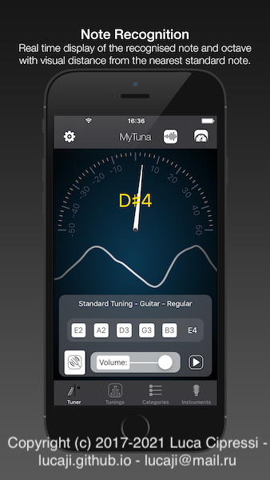
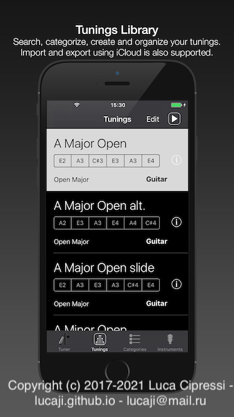
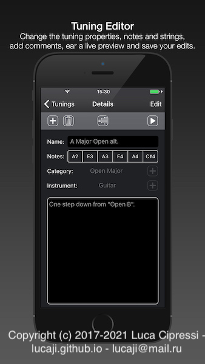
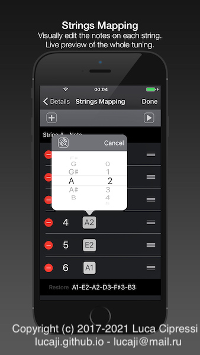
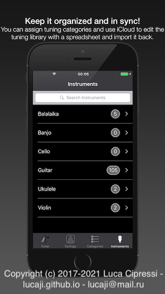
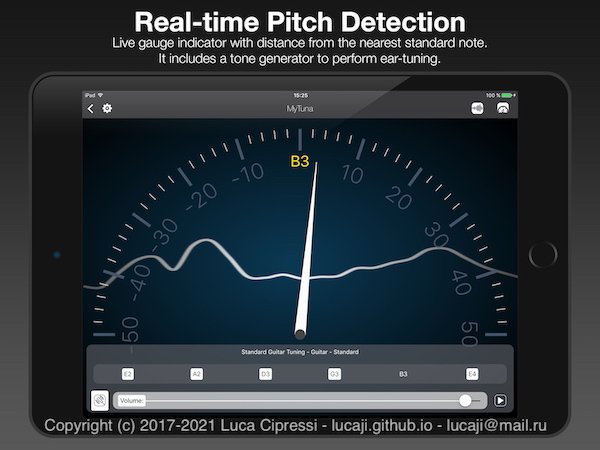
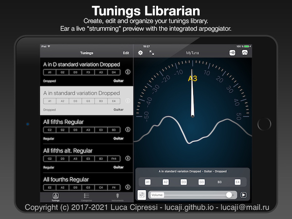
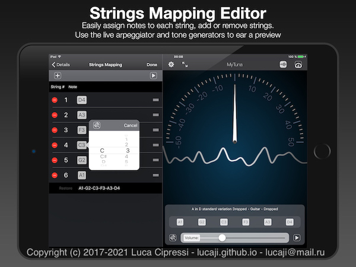
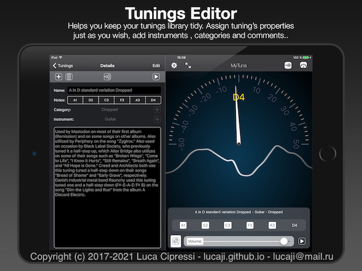
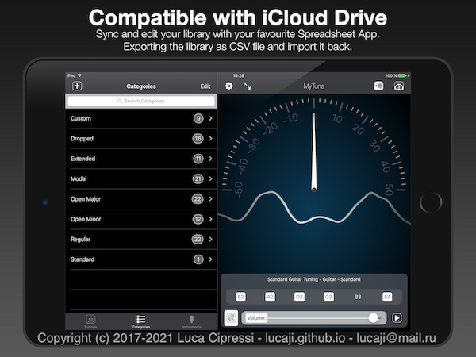

# MyTuna

 **A TUNING LIBRARIAN FOR STRINGED INSTRUMENTS**

If you play guitar, or even violin, or any other stringed instrument, you might find this app useful :)

    a native iOS app with mixed Objective-C and Swift code.
    using AudioKit library (an old copy is included)
    complete with modern UI/UX design

The original project went online for the first time on the AppStore in 2017. Some time later, I pulled all my apps out of the stores and started a new job. So far, so good. I was looking and my source code folders just lying in my hard disk's folders and decided to went open source :)

It should build no problems, make sure you have entitlements active in your Apple Developer Account to use the iCloud facilities.

## FEATURES

- Editor/Librarian of musical tunings for stringed instruments
- audio preview of the tuning
- note recognition
- export/import functions for data as CSV text files
- iCloud support for syncing

## LICENSES

The source code is available with a permissive MIT license (the first LICENSE file in the root directory).
The AppIcon and UI Elements graphic assets are distributed under a CC-BY-4.0 LICENSE (see the LICENSE file inside the Assets directory)

## USER EXPERIENCE SCREENSHOTS

A lot of effort has been put into the User Interface design in the hope that it could be appreciated by many :)

The iPhone UX screenshots:

The iPad UX screenshots:

